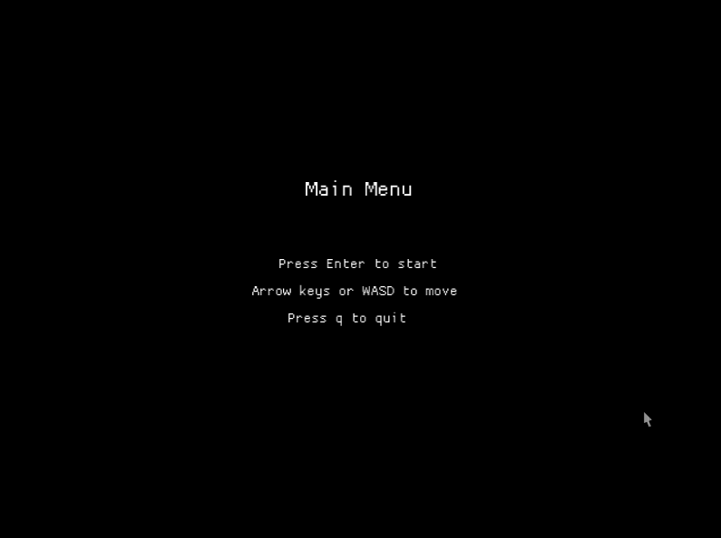

# AstroRust
Coding challenge to learn rust. Reference: [challenge-asteroids](https://codingchallenges.fyi/challenges/challenge-asteroids)

## Development Setup
Rust setup: [get-started](https://www.rust-lang.org/learn/get-started)

## Play
```
cargo run
```

